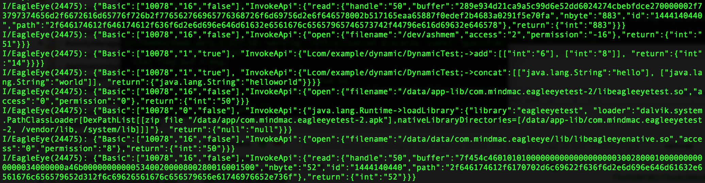

Android EagleEye
========

An [Xposed](http://repo.xposed.info/) and [adbi](https://github.com/crmulliner/adbi) based module which is capable of hooking both Java and Native methods targeting Android OS. Related information of the hooked methods will be logged as the output.

**Using Android EagleEye is entirely at your own risk**

Features
--------
* Able to hook both Java and Native methods
* Only configure files needed to hook customized Java methods
* Hook customized Java methods dynamically loaded through DexClassLoader
* Hook Native methods from both system and application libraries
* Adopt methods against anti-emulator

Contents
--------
* EagleEye: Source code of the Android EagleEye
* EagleEyeTest: A test application for EagleEye
* testcase_configs: Configures of customized Java system APIs, application's methods and native lib needed to be hooked(for EagleEyeTest)

Usage
--------

**Ensure you have root access and have installed [XposedInstaller](http://repo.xposed.info/module/de.robv.android.xposed.installer)**

Follow the steps below:

1. Install *EagleEye.apk* and enable this module in XposedInstaller
2. Reboot the Android device
3. Set the property *rw.eagleeye.fr.uids* to the *uids* of the applications you want to hook for Java methods, while for native hooking, please set the property *rw.eagleeye.nt.uids*, for example:
	* *adb shell su -c setprop rw.eagleeye.fr.uids "10076|10078"* for Java hooking(uids are splitted by "|")
	* *adb shell su -c setprop rw.eagleeye.nt.uids "10076|10078"* for Native hooking
5. **Restart** the applications you want to hook (EagleEye will read the *rw.eagleeye.fr.uids* and *rw.eagleeye.nt.uids* properties whenever the application loaded, so if you want to hook other applications, you only need set these two properties to the appropriate value and restart the applications)
6. Use *adb logcat -s EagleEye:I* to see the log information

### HOW to HOOK MORE JAVA METHODS

**EagleEye hooks some Java system APIs by default (refer to the classes under *com.mindmac.eagleeye.hookclass* package and *hooks/hook_apis.c* under *jni* directory), if you want to hook other Java system APIs or applications' methods, you can configure as following:**

1. The Java system APIs can be customized by the **fr_sys_apis.config** (Refer to *Configure File Format* section for detail). Please push this configure file to the Android device's directory **/data/local/tmp/**. The default number of APIs you can customize is limited to 500, and you can set the property **rw.eagleeye.fr.sys_api_num** to the value as you want.
2. The Java application's methods can be customized by the **fr_app_apis.config**  (Refer to *Configure File Format* section for detail). Please push this configure file to the Android device's directory **/data/data/\<package name of the application you want to hook\>/**. The default number of methods you can customize is limited to 500, and you can set the property **rw.eagleeye.fr.app_api_num** to the value as you want.
3. **Restart** the application you want to hook (EagleEye will reload the configure files when the application loaded).

**Please make sure both *fr_sys_apis.config* and *fr_app_apis.config* is readable by the hooked application (Use *chmod* if needed).**

### HOW to HOOK MORE NATIVE METHODS
**EagleEye utilizes *adbi* to hook Native methods（injection part is not needed）, and hooks some Native methods in system library by default (please refer to *hook_apis.c* under jni directory). Currently you need to add extra native codes to hook methods you want. Please follow the steps below to hook more native methods. The only file you need to touch is the *hook_apis.c*.**
 
1. Declare the method you want to replace the target method (parameter types and return type should be the same as the original method).
2. Initiliaze the **HOOK_INFO** struct, the variable name should start with **system_hook_info** for methods in system libraries, while it should start with **custom_hook_info** for methods in application own libraries. The second member is the library name of the method you want to hook(key words **lib** at the beginning is needed); the third member is the target method; the forth and last member can be set to the declared method in Step 1.
3. Implement the method declared in Step 1. Please refer to the **hook_apis.c** for detail implementaion scheme.
4. Execute **ndk-build** under the EagleEye project directory to re-build the native code.
5. Re-install the modified EagleEye application to the device.
6. For hooking native methods in the application's own library, an extra configure file is needed. Please specify the library names (one library name each line, the library name should starts with **lib** key word and **.so** is not needed) in the **native_lib.config** and push it to the **/data/data/\<package name of the application you want to hook\>**. Please make sure the **native_lib.config** is readable by the hooked application.

Anti Anti-Emulator
--------
Some Android applications will check the runtime environment to see if they are running on the Android emulator. EagleEye adopts some methods based on *runtime hook* against such anti-emulator technique. Take the [anti-emulator](https://github.com/strazzere/anti-emulator) project authored by Tim Strazzere for example, the output is shown as below after deploying EagleEye:

V/AntiEmulator( 2226): Checking for Taint tracking...  
V/AntiEmulator( 2226): hasAppAnalysisPackage : false  
V/AntiEmulator( 2226): hasTaintClass : false  
V/AntiEmulator( 2226): hasTaintMemberVariables : false  
V/AntiEmulator( 2226): Taint tracking was not detected.  
V/AntiEmulator( 2226): Checking for Monkey user...  
V/AntiEmulator( 2226): isUserAMonkey : false  
V/AntiEmulator( 2226): Monkey user was not detected.  
V/AntiEmulator( 2226): Checking for debuggers...  
V/AntiEmulator( 2226): No debugger was detected.  
V/AntiEmulator( 2226): Checking for QEmu env...  
V/AntiEmulator( 2226): hasKnownDeviceId : false  
V/AntiEmulator( 2226): hasKnownPhoneNumber : false  
V/AntiEmulator( 2226): isOperatorNameAndroid : false  
V/AntiEmulator( 2226): hasKnownImsi : false  
V/AntiEmulator( 2226): hasEmulatorBuild:false  
V/AntiEmulator( 2226): hasPipes : false  
*V/AntiEmulator( 2226): hasQEmuDriver : true*  
V/AntiEmulator( 2226): hasQEmuFiles : false   
*V/AntiEmulator( 2226): hasEmulatorAdb :true*   
*V/AntiEmulator( 2226): hitsQemuBreakpoint : true*  
V/AntiEmulator( 2226): QEmu environment detected.

There are still several anti-emulator methods which EagleEye does not take into consideration currently.

Configure File Format
--------
The **fr_sys_apis.config** and **fr_app_apis.config** are both in the same format.
Described as following:

1. APIs or methods you want to hook are separated by lines.
2. The number of APIs or methods EagleEye will read is constrained by the property **rw.eagleeye.fr.sys_api_num** or **rw.eagleeye.fr.app_api_num**. The default value is set to 500.
2. Each API or method is in the *smali* format. For example, if you want to hook [Intent.putExtra()](http://developer.android.com/reference/android/content/Intent.html#putExtra(java.lang.String, java.lang.String)), the content line will look like this:
	* Landroid/content/Intent;->putExtra(Ljava/lang/String;Ljava/lang/String;)Landroid/content/Intent;
3. The parameters and return type can be left blank to hook all the APIs or methods with the same method name. For example, you can configure the content line as below to hook all the *putExtra* methods under [Intent](http://developer.android.com/reference/android/content/Intent.html) class:
	* Landroid/content/Intent;->putExtra
4. To hook constructors, the scheme is like this *Lpackage/name/class_name;->class_name(parameter_types)*. For example, if you want to hook the Intent constructor *Intent(String action)*, you can specify the configure like this: Landroid/content/Intent;->Intent(Ljava/lang/String;) or Landroid/content/Intent;->Intent to hook all Intent constructors.
	
The **native_lib.config** format is very simple. Library names are separated by lines. Each library name should start with key word **lib** and **.so** is **not** needed.
	
Refer to the configure files under the [testcase_configs](testcase_configs) for more detail.

Log Format
--------
EagleEye will log the parameter and return value of the hooked methods in JSON format. The hooked application's *uid*, *hook type(framework system api-0x00*, *framework app method-0x01*, *native system api-0x10*, *native app method-x011)* and *if the method is customized* will be logged. For predefined Java system APIs and Native methods, parameter names will be recorded instead of parameter types.

A typical log is shown as below, "10078" represents the target application's uid; "16" indicates the hook type, here is native system api; "false" value shows that this method is not customized.

*{"Basic":["10078","16","false"],"InvokeApi":{"open":{"filename":"/data/data/com.mindmac.eagleeye/lib/libeagleeyenative.so","access":"0","permission":"8"},"return":{"int":"50"}}}*

Since Android's Logcat will truncate the log if it exceeds 1024 bytes, EagleEye will devide the content of file read and write operation into multiple parts.You can reconstruct the content based on the *id* value. The target file path and file content are both in hex bytes. Records of file operations are shown as below:

*{"Basic":["10078","0","false"], "FdAccess": {"path": "2f73746f726167652f656d756c617465642f302f44796e616d69632e61706b", "id": "1577699679" }}*

*{"Basic"["10078","0","false"],"FileRW":{ "operation": "write", "data": "504b0304140008080800f4b0d6463100c38daf020000fc06000013000400416e64726f69644d616e69666573742e786d6cfeca00008d543d6f1341149cbdb3938bf381f369c736120515c2074401457449400a52a0004145636207ac248e655f42a021252525053f00217e00250505bf809a9a3a652498f76e8f5b5f1cc19dc6bb3b3b3befeddb3dfb08703a0218d4f0dd072e227dde39fd0ab14c3c240eeddc07e213f185f846fc2042032c11778823e233f195f8459c10a744c5a38ed8209e12af89f7c447e22771428c334a0b3df4d1c63e3a58e76f93ccd9990768604f6726d9b6c93ca272074f0654401111953d3c271f9da319a76297ef3e5e628dfd2d6a0ed0e54c8e9a2dabca53d1c033aeddd5518417ecc739e4a848f21965afc3383dae6bb305ae5019f1ede236aef1edd3335edb603fcce8438db8475d832b76d8f6a8edeb78d0171aad6b336ee81e813219c934c236953d3aad71376d72cdccced3eafeff9ab4ee81e6df21bfadf945e4666dee219923558a6f8be3265ed91a4945011f37c85e67cfc312fb728e37950939aa13b7c82febbba2d10e1843e2d40939c5f8dcba1a413c25fbe44403ad898c0f8988b1c53fc47df272575687cc0a1f3182fcd6b927d97da47b0746fefac5fe953367e6ae0e07d4127515f75839c92bceb3c5b3923a4be44bfff0caae08b149bfc7f45bc706eeeab7796c025c655bf58ca91113449738263c1863087eedc697d61479de5277e0379f31b60519937febf0f25c607f8e6fdedeb6826d652ee0c7652c27edb4ee0ffeb49d9fd0af2fe68a969b643b1373c579cb4de9bd8975b3368f4dbdd9691e73360fcfc9c373f298b29cef70e2efdbbd8e65bc2446a43728e5e76d8c9c136334f563e146de14f42ea41cff0794cb0f709e72b9949b9136d957d189b930645fc3fcd947c9d6a864f3bf6ceb967895ad57f2886645b954b36835c68917d8ff79f1ae3835cbae4bfc161cbe7a8e5fcdfad51cbfecba842f65f690f0e54c9d127e317366095fcddc5b93e1937bfe07504b07083100c38daf020000fc060000504b03040a0000080000568a", "id": "1577699679"}}*

*{"Basic"["10078","0","false"],"FileRW":{ "operation": "write", "data": "d54662df48f24c1700004c170000240002007265732f6472617761626c652d686470692d76342f69635f6c61756e636865722e706e67000089504e470d0a1a0a0000000d494844520000004800000048080600000055edb347000017134944415478daed5b69905dc575fe4ef75dde326f66342369b401328b8d05212c31066313f00201dbb81c22657116d9a932492a4e2524ae2cae0a0f278e718c8dcb29db31210976e2251a6f0a0107a41805634258a25844022421242446d268f6b7dd7bbbfb9cfce8fb16c9d81ac733b64971abeebc59eebc77fbeb73beef3ba7fb022f1d2f1d2f1d2f1dff4f0f916ab027fdfd759bf75d3722025ad8f77e77f87476c34f6e3df4f6e1c51c835a3c7040ffb2ebf155bbf7effbebac9ebdefe66d6be3938124029a0f902255b5d3b80b0e8d4f7de1c96f8fff6a55aa6aa12760d1010280c7b78fcfec7ef2c8ae2cb5bf7266e5f48db73f7e51d01da4507bb0229bb4882860bd1ac57a2522caffde0f5c443ac089807635c6971f9bacddb2f3bfc7069efeafdab7aba80a116431c6102c1638441091ffac7df0ce4b3f562fa76fa82c897f2f6c15ef13a9eeef62f47b4583152f076a17103ebd92f1fafeb721a40c7fd710ac19cfc04f1cc32d3b4f07e6006093acd7bb005dcb66371e3e347dd1d8fee6a732173ebc38b1938f63b179a85aadaaf8ac7baf1f5e19de1ec56aeb9983a7fefe25eb2e3dcf22bd96e1de2230ab1d2c010286411313c8d002a001c4000a53cee9fb8ce37b9ab6fc8da4b9efac23e3935fddf1c8f88e47b7a46f7fd5cbaf9fad56abfca2050802baedce2b069a61fd96534eeffbf9cbcfb978d7507fe5150a6a10d0ca2121861382c0c2a1854934310d0786858513013b2d9c857576e5c7a6a666fb9f7874ec94677737de3962aebf7731c159d414ebe253a5f18d76d836c2208bf695fa43ba14509221510a408c214458420a1118161a87902003c3003010b6b0d6927169c59a992bc302c9d295f1b70787fa67c7be59850868b1f807791c2fa6ccab43983dbd1f239fa0a8f9b6580f840a054a3043050ca00fa722c410081104", "id": "1577699679"}}*

*{"Basic":["10078","16","false"],"InvokeApi":{"read":{"handle":"49","buffer":"26818ff2f1a451310b80e7207921660aa10f2ac4a051c5973b901a9bea951a9993760d015f4ff78ce3e0f85c6f281e882c799a9f471535b7de6b343affd06a5fab22b76f9403ac5339bf27dedb6d54ea866b9c82db31f6228b02bc588206cb24e2f77b2cc2871868128ba3e022fdb977abd5f098b93326ee3d5815d0377caea0aa64b4ac480827b01a0821720068e628ca6f56b40ede97d30a3173d2643e264832c748ac63e47ea8a9389e63ebfd6aa0f85ccb8166714849e01c015e5a0572fcf6c74379e8385a83ee30fd13a75c998064cfde1a494787538c5cddb6b2f8789bc45a15f74da855d9833f2a61def8d1aba7f8ddafe42e501b27a4c3416c28e83ffa3d4d9a1a85f7a1a695cdd383db12a6db96c51f982bb1e0d8dfd1625f285af884417661337be84c99839687","nbyte":"65557","id":"1444149052","path":"2f73746f726167652f656d756c617465642f302f44796e616d69632e61706b"},"return":{"int":"65557"}}}*

*{"Basic":["10078","16","false"],"InvokeApi":{"read":{"handle":"49","buffer":"5227cc95b7489f62915bbad3db9606d501d2a7cc1e7ac3a4b316ad58d98fb81613ec6a7cc2374c98b491293584cfe06749975e65ba1a8f3409c7f623359edd76544bb9a107b9de280303e2b068d3c012ae06dde01510e5bbb8a08d006bc458e26a54b01a60e7159de38f4dc79973c9303b23db28a07e615935721c0941b34ec43c58235975fcbd96fb8a1263e5fe8a9268e545d074ee49ef7dcac6af03f826f9369fec267a4e1e5c1c45599c483ea6d0966635229d649c2ab5c69e666ee1976322234682e0557f8144b1166b8aab7aa72226c9b917216529c95a94e63d17df8988e054c198aadc72a394e2427428d9a973b2190a0a9c581cf578afee20fa0cbdeb301917b2bf501b3a9d03d79924438ef22447457d27820dac18310a3750c9bdcd1e0a9a74e9cf82a038dfe5","nbyte":"65557","id":"1444149052","path":"2f73746f726167652f656d756c617465642f302f44796e616d69632e61706b"},"return":{"int":"65557"}}}*
